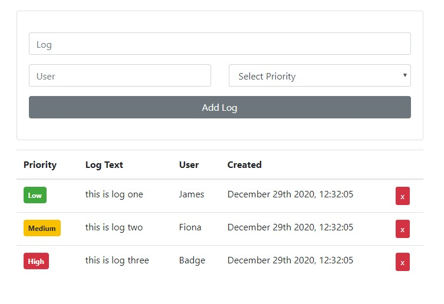

# Simple Electron React Boilerplate

This is a based on a simple boilerplate using Electron and React. It is a customized version of [Alex Devero's](https://github.com/alexdevero/electron-react-webpack-boilerplate) repo and is used in my Electron course.

## Notes

- Using [yarn](https://www.npmjs.com/package/yarn) instead of basic npm terminal commands
- If getting a "404 index.html not found" error in development - check the host address in main.js
- Uses [React-Bootstrap](https://react-bootstrap.github.io/) for styling
- Uses [Moment](https://momentjs.com/) and [React-Moment](https://github.com/headzoo/react-moment#readme) for formatting timestamps
- Uses [useState](https://reactjs.org/docs/hooks-state.html) React State Hooks to pass information between the UI App.js and the custom components we have created.



---

## Install Advice

### Install dependencies

```Bash
yarn
```

maybe also run:

```Bash
yarn upgrade
```

---

## Usage

### Run the app

```Bash
yarn start
```

### Build the app (automatic)

```Bash
yarn package
```

### Build the app (manual)

```Bash
yarn build
```

### Test the app (after "yarn run build")

```Bash
yarn prod
```

---

### Change app title

Change the app title in the **webpack.build.config.js** and the **webpack.dev.config.js** files
